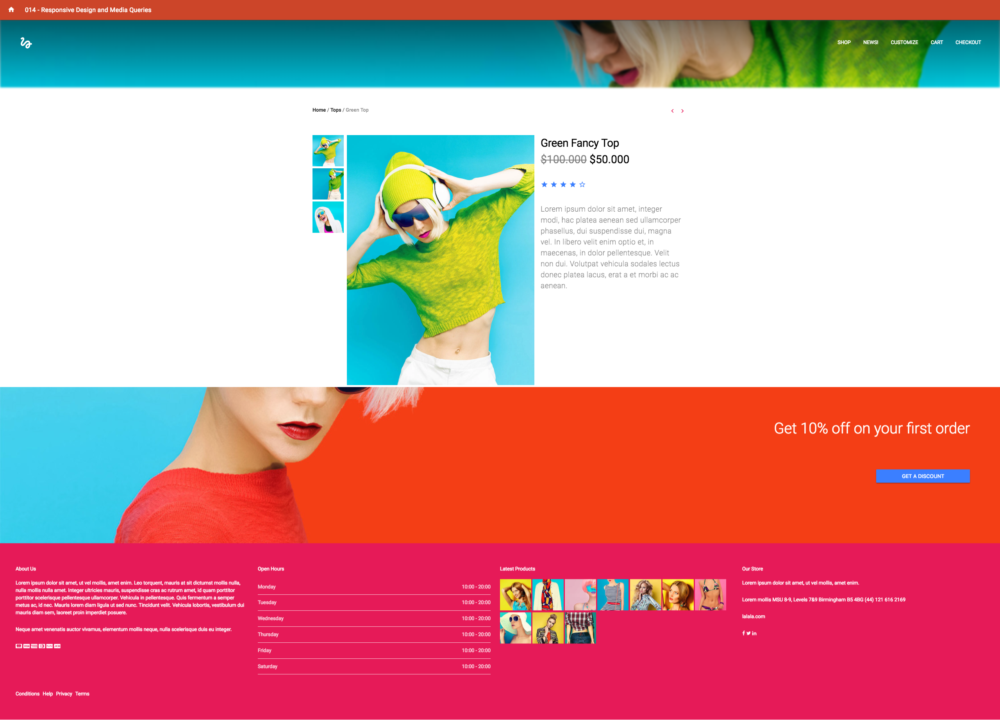

# 014 - Responsive Design and Media Queries

### Before 
You should read about Responsive Design here :

1. [How To Use CSS3 Media Queries To Create a Mobile Version of Your Website][1].
2. [A List Apart – Responsive Web Design][2]
3. [Media Queries for Standard Devices][3]
4. [How To Write Mobile-first CSS][4]

#
The estimation for this practice is: 8 hours.
#

### To Do

Run the base project.

```sh
$ npm install http-server -g
$ cd u-css/
$ http-server ./src -p 3000
```

Please check and make the same design and animations than page has in the solution part, go there clicking in solution button from each box in the home view.

Using Mobile first method, follow the next steps:


1. Define the breakpoints for media queries. Minimum size is: 320px and Maximum size is 1200px.
2. Follow the final design.



 
### Evaluation Criteria

1. Make it Readable.
2. Good Practices.
3. Use HTML5.
4. Structure Naming Convention.
5. Responsive skills screens from 320px.
6. Use correct Cascade code.
7. Use correct Inheritance.
8. Goal: The practice should look as be required.

 [1]: https://www.smashingmagazine.com/2010/07/how-to-use-css3-media-queries-to-create-a-mobile-version-of-your-website/
 [2]: https://alistapart.com/article/responsive-web-design
 [3]: https://css-tricks.com/snippets/css/media-queries-for-standard-devices/
 [4]: https://zellwk.com/blog/how-to-write-mobile-first-css/
